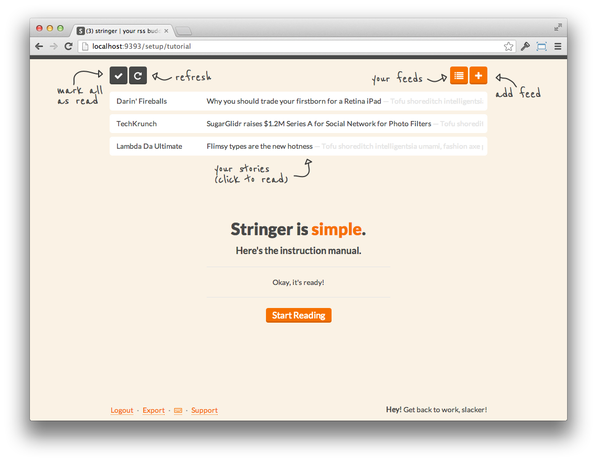
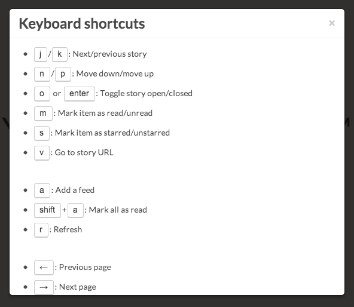

# Stringer

[](https://circleci.com/gh/stringer-rss/stringer/tree/main)
[](https://codeclimate.com/github/stringer-rss/stringer/maintainability)
[](https://coveralls.io/github/stringer-rss/stringer?branch=main)
[](https://github.com/sponsors/mockdeep)

### A self-hosted, anti-social RSS reader.

Stringer has no external dependencies, no social recommendations/sharing, and no fancy machine learning algorithms.

But it does have keyboard shortcuts and was made with love!




## Installation

Stringer is a Ruby app based on Rails, PostgreSQL, Backbone.js and GoodJob.

[](https://heroku.com/deploy?template=https://github.com/stringer-rss/stringer)

Stringer will run just fine on the Eco/Basic Heroku plans.

Instructions are provided for deploying to [Heroku manually](/docs/Heroku.md), to any Ruby 
compatible [Linux-based VPS](/docs/VPS.md), to [Docker](docs/Docker.md) and to [OpenShift](/docs/OpenShift.md).

## Niceties

### Keyboard Shortcuts

You can access the keyboard shortcuts when using the app by hitting `?`.



### Using your own domain with Heroku

You can run Stringer at `http://reader.yourdomain.com` using a CNAME.

If you are on Heroku:

```
heroku domains:add reader.yourdomain.com
```

Go to your registrar and add a CNAME:
```
Record: CNAME
Name: reader
Target: your-heroku-instance.herokuapp.com
```

Wait a few minutes for changes to propagate.

### Fever API

Stringer implements a clone of [Fever's API](http://www.feedafever.com/api) so it can be used with any mobile client that supports Fever.


Use the following settings:

```
Server: {path-to-stringer}/fever (e.g. http://reader.example.com/fever)

Email: stringer (case-sensitive)
Password: {your-stringer-password}
```

### Translations

Stringer has been translated to [several other languages](config/locales). Your language can be set with the `LOCALE` environment variable.

To set your locale on Heroku, run `heroku config:set LOCALE=en`.

If you would like to translate Stringer to your preferred language, please use [LocaleApp](http://www.localeapp.com/projects/4637).

### Clean up old read stories on Heroku

You can clean up old stories by running: `rake cleanup_old_stories`

By default, this removes read stories that are more than 30 days old (that
are not starred). You can either run this manually or add it as a scheduled
task.

## Development

Run the Ruby tests with `rspec`.

Run the Javascript tests with `rake test_js` and then open a browser to `http://localhost:4567/test`.

### Getting Started

To get started using Stringer for development you first need to install `foreman`.

    gem install foreman

Then run the following commands.

```sh
bundle install
rails db:setup
foreman start
```

The application will be running on port `5000`.

You can launch an interactive console (a la `rails c`) using `rake console`.

## Acknowledgments

Most of the heavy-lifting is done by [`feedjira`](https://github.com/feedjira/feedjira) and [`feedbag`](https://github.com/dwillis/feedbag).

General sexiness courtesy of [`Twitter Bootstrap`](http://twitter.github.io/bootstrap/) and [`Flat UI`](http://designmodo.github.io/Flat-UI/).

ReenieBeanie Font Copyright &copy; 2010 Typeco (james@typeco.com). Licensed under [SIL Open Font License, 1.1](http://scripts.sil.org/OFL).

Lato Font Copyright &copy; 2010-2011 by tyPoland Lukasz Dziedzic (team@latofonts.com). Licensed under [SIL Open Font License, 1.1](http://scripts.sil.org/OFL).

## Contact

If you have a question, feature idea, or are running into problems, our preferred method of contact is to open an issue on GitHub. This allows multiple people to weigh in, and we can keep everything in one place. Thanks!

## Maintainers

Robert Fletcher [boon.gl](https://boon.gl)

## Alumni

Matt Swanson (creator), [mdswanson.com](http://mdswanson.com), [@_swanson](http://twitter.com/_swanson)
Victor Koronen, [victor.koronen.se](http://victor.koronen.se/), [@victorkoronen](https://twitter.com/victorkoronen)
