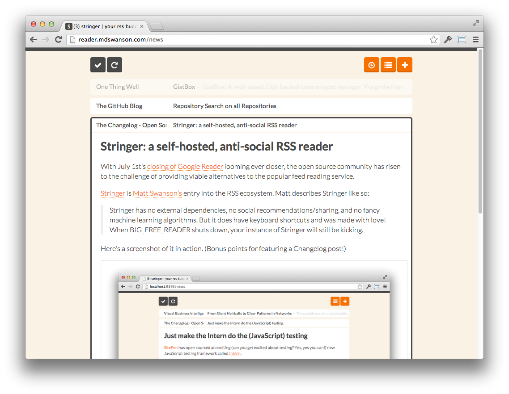

# Stringer

[](https://travis-ci.org/swanson/stringer)
[](https://codeclimate.com/github/swanson/stringer)
[](https://coveralls.io/r/swanson/stringer)

### A self-hosted, anti-social RSS reader.

Stringer has no external dependencies, no social recommendations/sharing, and no fancy machine learning algorithms.

But it does have keyboard shortcuts and was made with love!





## Installation

Stringer is a Ruby (2.0.0+) app based on Sinatra, ActiveRecord, PostgreSQL, Backbone.js and DelayedJob.

[](https://heroku.com/deploy)

Stringer will run just fine on the Heroku free plan.

Instructions are provided for deploying to [Heroku manually](/docs/Heroku.md), to any Ruby 
compatible [Linux-based VPS](/docs/VPS.md), and to [OpenShift](/docs/OpenShift.md).

## Niceties

### Keyboard Shortcuts

You can access the keyboard shortcuts when using the app by hitting `?`.


### Using you own domain with Heroku

You can run Stringer at `http://reader.yourdomain.com` using a CNAME.

If you are on Heroku:

```
heroku domains:add reader.yourdomain.com
```

Go to your registrar and add a CNAME:
```
Record: CNAME
Name: reader
Target: your-heroku-instance.herokuapp.com
```

Wait a few minutes for changes to propagate.

### Fever API

Stringer implements a clone of [Fever's API](http://www.feedafever.com/api) so it can be used with any mobile client that supports Fever.


Use the following settings:

```
Server: {path-to-stringer}/fever (e.g. http://reader.example.com/fever)

Email: stringer (case-sensitive)
Password: {your-stringer-password}
```

If you have previously setup Stringer, you will need to migrate your database and run `rake change_password` for the API key to be setup properly.

### Translations

Stringer has been translated to [several other languages](config/locales). Your language can be set with the `LOCALE` environment variable.

To set your locale on Heroku, run `heroku config:set LOCALE=en`.

If you would like to translate Stringer to your preferred language, please use [LocaleApp](http://www.localeapp.com/projects/4637).

### Clean up old read stories on Heroku

If you are on the Heroku free plan, there is a 10k row limit so you will
eventually run out of space.

You can clean up old stories by running: `rake cleanup_old_stories`

By default, this removes read stories that are more than 30 days old (that
are not starred). You can either run this manually or add it as a scheduled
task.

## Development

Run the Ruby tests with `rspec`.

Run the Javascript tests with `rake test_js` and then open a browser to `http://localhost:4567/test`.

### Getting Started

To get started using Stringer for development you first need to install `foreman`.

    gem install foreman

Then run the following commands.

```sh
bundle install
rake db:migrate
foreman start
```

The application will be running on port `5000`.

You can launch an interactive console (ala `rails c`) using `racksh`.

## Acknowledgements

Most of the heavy-lifting is done by [`feedjira`](https://github.com/feedjira/feedjira) and [`feedbag`](https://github.com/dwillis/feedbag).

General sexiness courtesy of [`Twitter Bootstrap`](http://twitter.github.io/bootstrap/) and [`Flat UI`](http://designmodo.github.io/Flat-UI/).

## Contact

Matt Swanson, [mdswanson.com](http://mdswanson.com), [@_swanson](http://twitter.com/_swanson)

Victor Koronen, [victor.koronen.se](http://victor.koronen.se/), [@victorkoronen](https://twitter.com/victorkoronen)
