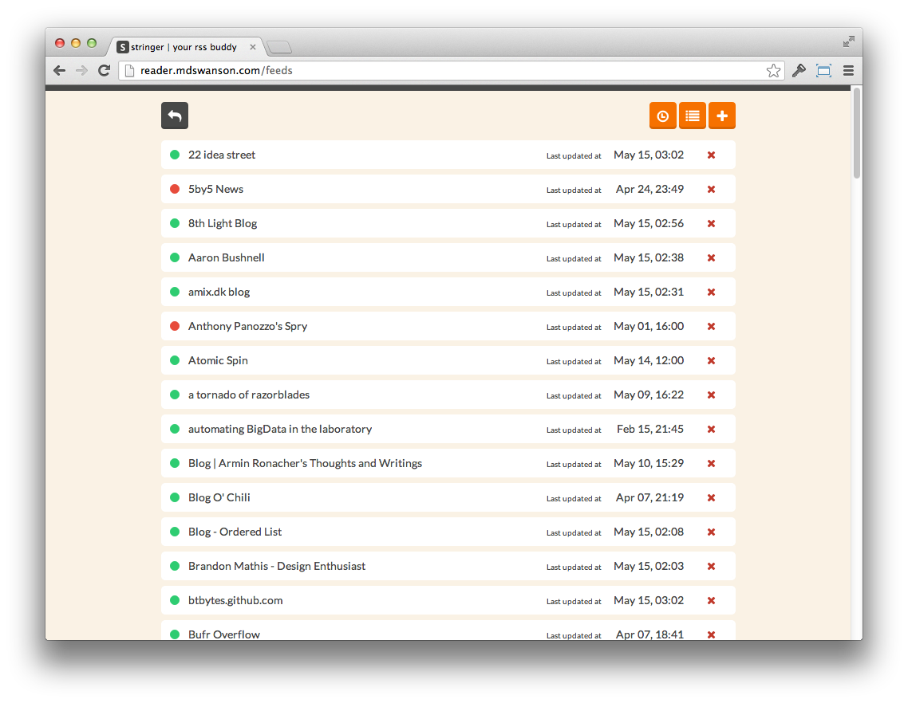

# Stringer

[](https://travis-ci.org/swanson/stringer)
[](https://codeclimate.com/github/swanson/stringer)
[](https://coveralls.io/r/swanson/stringer)

### A [work-in-progress] self-hosted, anti-social RSS reader.

Stringer has no external dependencies, no social recommendations/sharing, and no fancy machine learning algorithms.

But it does have keyboard shortcuts and was made with love!




## Installation

Stringer is a Ruby (2.0.0+) app based on Sinatra, ActiveRecord, PostgreSQL, Backbone.js and DelayedJob.

Instructions are provided for deploying to Heroku (runs fine on the free plan) but Stringer can be deployed anywhere that supports Ruby (setup instructions for a Linux-based VPS are provided [here](/docs/VPS.md), and for OpenShift, provided [here](/docs/OpenShift.md)).

```sh
git clone git://github.com/swanson/stringer.git
cd stringer
heroku create
git push heroku master

heroku config:set APP_URL=`heroku apps:info | grep -o 'http[^"]*'`
heroku config:set SECRET_TOKEN=`openssl rand -hex 20`

heroku run rake db:migrate
heroku restart

heroku addons:add scheduler
heroku addons:open scheduler
```

Add an hourly task that runs `rake lazy_fetch` (if you are not on Heroku you may want `rake fetch_feeds` instead).

Load the app and follow the instructions to import your feeds and start using the app.

---

In the event that you need to change your password, run `heroku run rake change_password` from the app folder.

## Updating the app

From the app's directory:

```sh
git pull
git push heroku master
heroku run rake db:migrate
heroku restart
```

## Niceties

### Keyboard Shortcuts

You can access the keyboard shortcuts when using the app by hitting `?`.


### Using you own domain with Heroku

You can run Stringer at `http://reader.yourdomain.com` using a CNAME.

If you are on Heroku:

```
heroku domains:add reader.yourdomain.com
```

Go to your registrar and add a CNAME:
```
Record: CNAME
Name: reader
Target: your-heroku-instance.herokuapp.com
```

Wait a few minutes for changes to propagate.

### Fever API

Stringer implements a clone of [Fever's API](http://www.feedafever.com/api) so it can be used with any mobile client that supports Fever.


Use the following settings:

```
Server: {path-to-stringer}/fever (e.g. http://reader.example.com/fever)

Email: stringer (case-sensitive)
Password: {your-stringer-api-key}
```

If you are running Stringer revision `0d35ec2` (May 15th 2013) or older, you
will need to migrate your database and run `rake change_password` for the API
key to be setup properly.

Your API key is the md5 checksum of the string `stringer:{your-stringer-password}`.
Assuming your password is "opensesame", the following command will calculate
your API key for you:

```sh
echo "stringer:opensesame" | md5sum | cut -d' ' -f1
```

### Translations

Stringer has been translated to [several other languages](config/locales). Your language can be set with the `LOCALE` environment variable.

To set your locale on Heroku, run `heroku config:set LOCALE=en`.

If you would like to translate Stringer to your preferred language, please use [LocaleApp](http://www.localeapp.com/projects/4637).

### Clean up old read stories

If you are on the Heroku free plan, there is a 10k row limit so you will
eventually run out of space.

You can clean up old stories by running: `rake cleanup_old_stories`

By default, this removes read stories that are more than 30 days old (that
are not starred). You can either run this manually or add it as a scheduled
task.

## Development

Run the Ruby tests with `rspec`.

Run the Javascript tests with `rake test_js` and then open a browser to `http://localhost:4567/test`.

### Getting Started

To get started using Stringer for development simply run the following:

```sh
bundle install
rake db:migrate
foreman start
```

The application will be running on port `5000`.

You can launch an interactive console (ala `rails c`) using `racksh`.

## Acknowledgements

Most of the heavy-lifting is done by [`feedzirra`](https://github.com/pauldix/feedzirra) and [`feedbag`](https://github.com/dwillis/feedbag).

General sexiness courtesy of [`Twitter Bootstrap`](http://twitter.github.io/bootstrap/) and [`Flat UI`](http://designmodo.github.io/Flat-UI/).

## Contact

Matt Swanson, [mdswanson.com](http://mdswanson.com) [@_swanson](http://twitter.com/_swanson)
